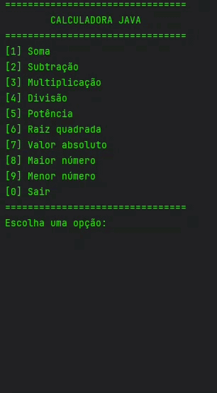

# 🧮 Calculadora Matemática em Java

Uma calculadora desenvolvida em Java que permite realizar operações matemáticas básicas e avançadas diretamente pelo terminal.

---

## 🎥 Demonstração

<p align="center">
  
</p>

---

## 🚀 Funcionalidades

* ➕ Soma
* ➖ Subtração
* ✖️ Multiplicação
* ➗ Divisão
* 🔼 Potência
* 📐 Raiz quadrada
* 🔢 Valor absoluto
* 📊 Maior número entre vários valores
* 📉 Menor número entre vários valores

---

## 🧠 Conceitos aplicados

* 📦 Programação Orientada a Objetos (POO)
* 🔁 Estruturas de repetição (`for`, `while`)
* 📁 Arrays
* 🧮 Classe `Math`
* 🎯 Separação de responsabilidades (Menu e Calculator)

---

## 🏗️ Estrutura do projeto

```
App.java        -> ponto de entrada
Menu.java       -> interação com o usuário
Calculator.java -> lógica das operações matemáticas
```

---

## ▶️ Como executar

```bash
javac App.java
java App
```

---

## 🎮 Como usar

Escolha uma opção no menu:

```
================================
        CALCULADORA JAVA
================================
[1] Soma
[2] Subtração
[3] Multiplicação
[4] Divisão
[5] Potência
[6] Raiz quadrada
[7] Valor absoluto
[8] Maior número
[9] Menor número
[0] Sair
================================
```

---

## 📌 Objetivo

Este projeto foi desenvolvido com o objetivo de praticar lógica de programação e conceitos fundamentais de Java, especialmente o uso de métodos matemáticos e organização em POO.

---

## 💡 Possíveis melhorias futuras

* 🧾 Histórico de operações
* ⚠️ Validação de entrada do usuário
* 🖥️ Interface gráfica (Java Swing ou JavaFX)
* 🎚️ Mais operações matemáticas

---

## 👨‍💻 Autor

Desenvolvido por **Daniel Avelino** 🚀
